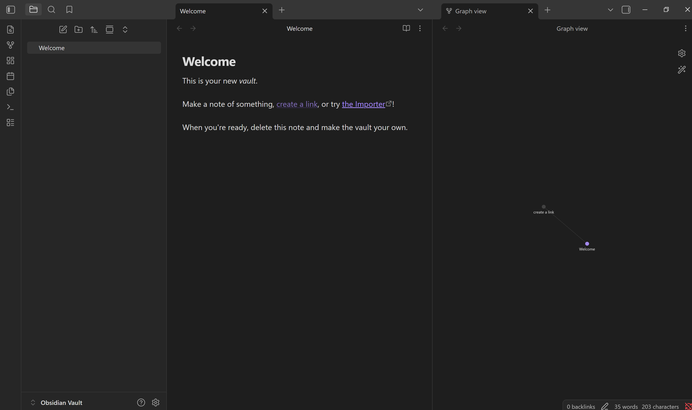
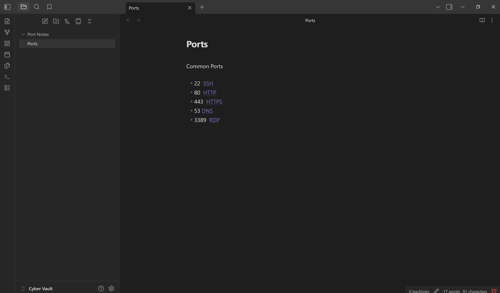
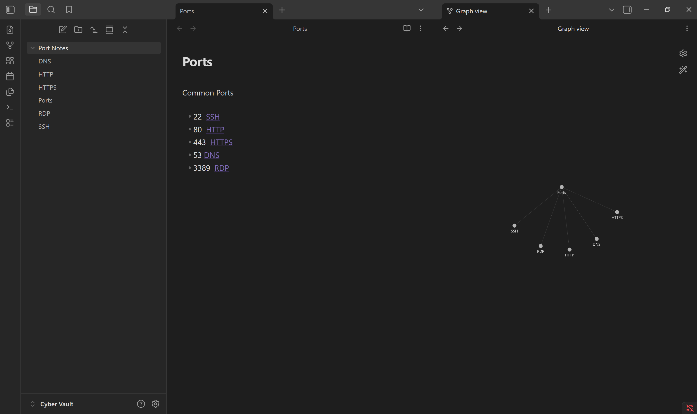
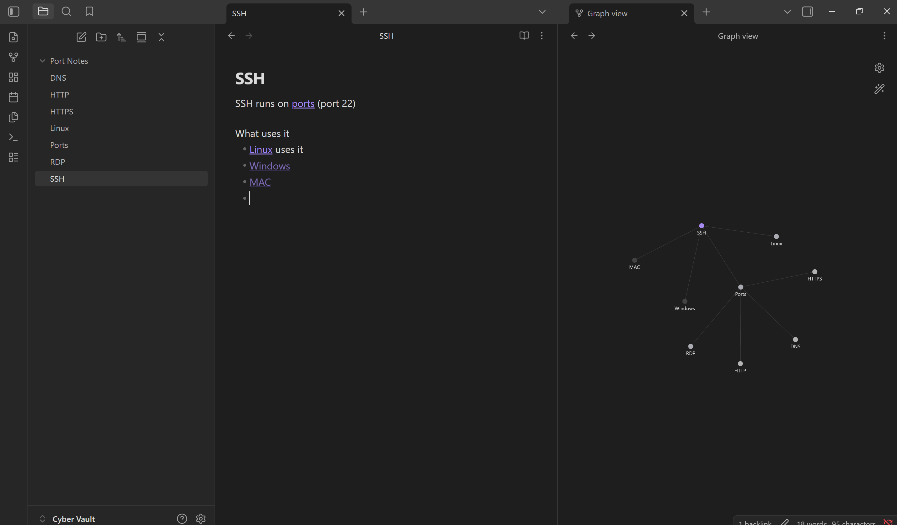
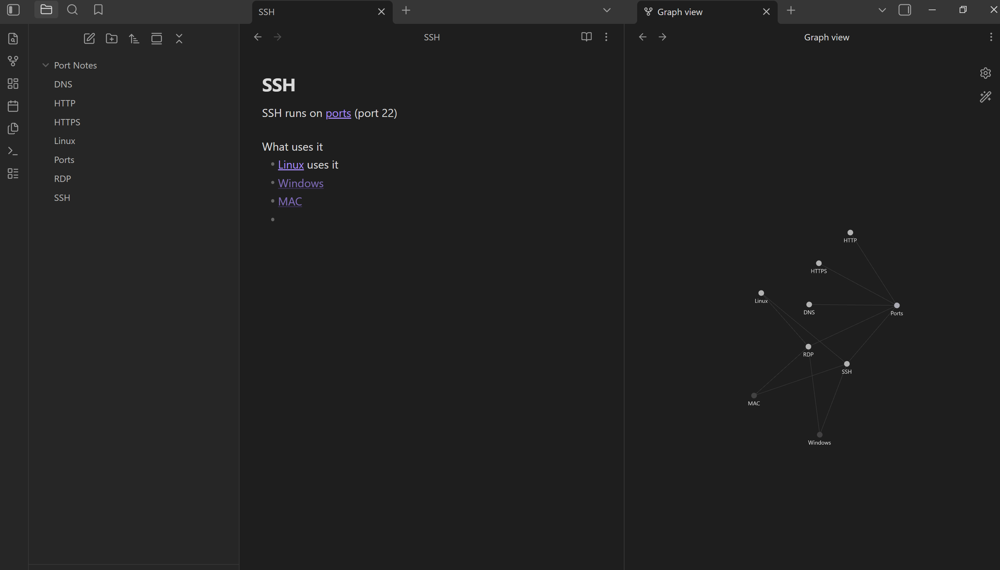
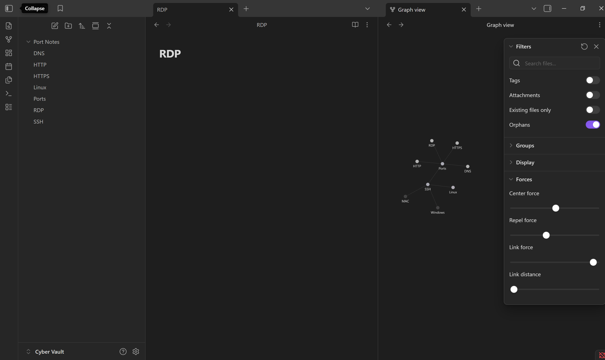
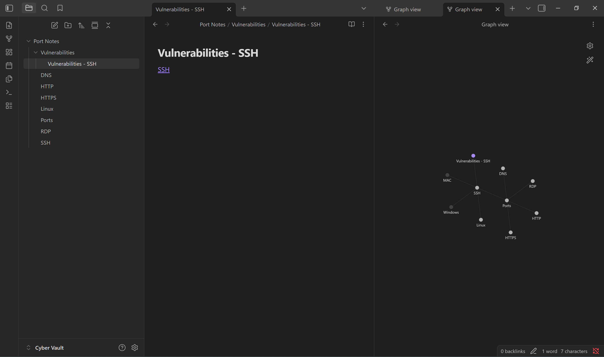

# Linking Cybersecurity Notes in Obsidian

I started using Obsidian to organize my cybersecurity notes, especially topics like ports, protocols, and vulnerabilities. Instead of keeping everything in separate documents, I wanted a way to connect related concepts.
When I first opened Obsidian, I was taken to a welcome page that showed some example features. One of the options said “create a link,” so I clicked on it to try it out. However, it wasn’t clear how the link was actually being created or how I could do it myself.

After looking more closely, I noticed that the words “create a link” were inside double brackets like [[]]. That’s when I realized that typing brackets is how links are created in Obsidian.
This relates to **Help and Documentation**, which means systems should provide clear instructions for users. In this case, the example showed that linking exists, but it did not clearly explain how to create a link, which made it harder to learn at first.
After that, I deleted the default notes and created my own folder called “Port Notes.” Inside that, I made a note called “Ports” where I listed common ports like SSH, HTTP, HTTPS, DNS, and RDP.

When I typed these as links, I noticed that clicking on them automatically created new notes. I then opened the graph view and saw that each note was connected visually.

Next, I opened the SSH note and started adding more details. While working on it, I wanted an easy way to go back to my main “Ports” note without having to search for it again. To do this, I typed [[ports]], which created a clickable link that lets me quickly go back to the Ports file.
This made the notes feel more connected, but also more navigable, since I could move between related topics easily.
At first, I expected there to be a button for linking, similar to how hyperlinks work in other applications. This shows an issue with **Consistency and Standards**, which means systems should follow common patterns that users are familiar with. Since most applications use buttons or menus for links, having to type brackets felt unfamiliar at first.
At the same time, once I understood how it worked, the bracket system actually supported **User Control and Freedom**, since it allowed me to quickly move between notes without relying on menus.
I continued adding more links, like connecting SSH to Linux, Windows, and Mac. As I added more connections, I checked the graph view again to see how everything was organized.

As more links were added, the graph became more cluttered and harder to read. Even though the connections were useful, it took more effort to understand what I was looking at. This relates to **Aesthetic and Minimalist Design**, which means interfaces should avoid unnecessary complexity. In this case, too many connections made the graph harder to understand.
I also tried to find a way to organize the graph automatically. I looked for a clear option but couldn’t find one right away. Eventually, I found settings called “Forces” that allowed me to adjust how the graph moves.

This connects to **Flexibility and Efficiency of Use** because it allows more advanced users to customize how the graph behaves. However, this feature was not very intuitive for a beginner, and it took time to figure out.
Finally, I experimented more by creating a folder called “Vulnerabilities” and adding a note called “Vulnerabilities - SSH,” linking it back to SSH.

This helped me understand how Obsidian can organize complex topics, but also showed that too many connections can make things harder to manage. Overall, this experience showed me that while Obsidian is powerful, it requires users to learn its system before it becomes efficient.

